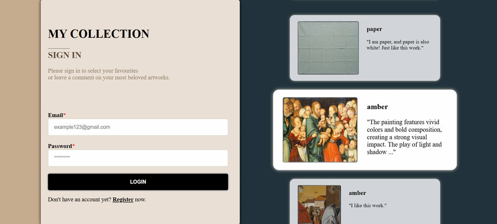
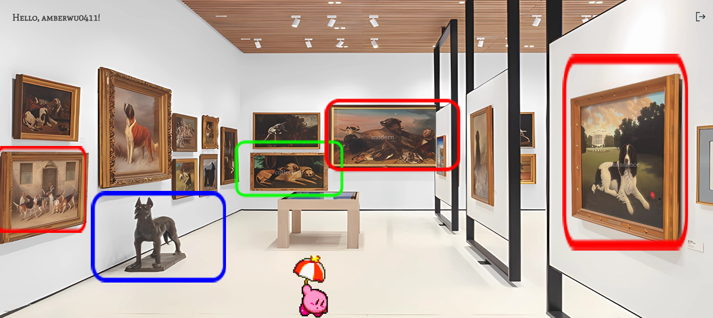
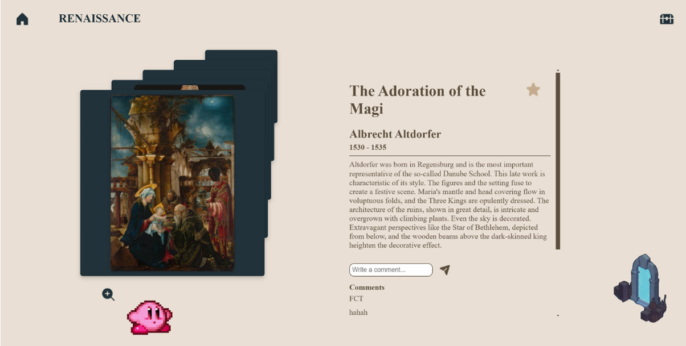
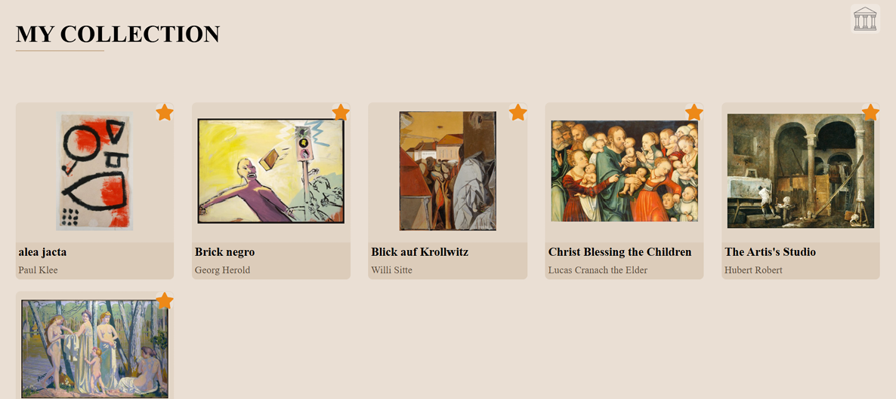

# Digital Art Walk 🎨🏛️

**Digital Art Walk** 是一款互動式虛擬博物館網站，提供沉浸式的數位藝術展覽體驗，讓用戶能夠在虛擬空間中自由瀏覽展品、查詢作品、收藏喜愛的藝術品，並與其他用戶交流心得。

---

## **📖 項目介紹**
### **🎯 設計動機**
傳統博物館網站大多僅提供靜態展示，缺乏互動性，本專案希望透過 **遊戲化的體驗** 提升觀展興趣，並：
- 提供沉浸式的數位博物館體驗
- 促進藝術愛好者與創作者之間的交流
- 讓展品收藏、評論更直覺，提升觀展參與度

### **🔹 主要功能**
✅ **虛擬博物館展區**
- WASD 控制角色 **卡比** 在展覽館移動
- 進入不同 **主題展間**，透過 **上下鍵切換展品**
- 展品旁有詳細介紹，可 **放大觀看**
- **NPC 對話功能**，可透過關鍵字搜尋展品

✅ **用戶收藏與社交互動**
- **登入 / 註冊** 功能，支援帳號管理
- 用戶可 **收藏喜愛的展品**，並在「收藏頁」管理作品
- **留言功能**：用戶可以在展品下方留下評論，與其他參觀者交流

✅ **後端支援**
- **資料庫管理**：儲存展品資訊、用戶帳號、收藏與評論
- **安全性**：密碼經 SHA256 加密，提升用戶資料安全性

---

## **🛠 技術細節**
### **📌 前端技術**
- **HTML / CSS / JavaScript**
- **Canvas API**: 控制虛擬角色移動與互動
- **AJAX & Fetch API**: 非同步加載用戶數據與展品資訊

### **📌 後端技術**
- **PHP & MySQL**: 管理用戶登入、收藏與評論系統
- **LocalStorage**: 儲存當前登入狀態，避免多次請求
- **SHA256 加密**: 提升密碼存儲安全性

### **📌 資料庫架構**
| Table | Description |
|-------|------------|
| users | 存儲用戶基本資訊 |
| user_collection | 存儲用戶收藏的展品 |
| user_comment | 用戶對展品的評論 |
| total_work | 所有展品資料 |
| category | 展品分類資訊 |

---

## **🚀 如何運行**
### **1️⃣ 安裝環境**
- **建議使用 Visual Studio Code (VS Code) 運行**
- 安裝 PHP 伺服器 (如 **XAMPP**)
- 確保 MySQL 伺服器正在運行

### **2️⃣ 克隆專案**
```bash
git clone https://github.com/your-repo/Digital-Art-Walk.git
cd Digital-Art-Walk
```

### **3️⃣ 設置資料庫**
1. 開啟 **phpMyAdmin**，建立一個新資料庫
2. 匯入 **database.sql**

### **4️⃣ 啟動伺服器**

---

## **📸 圖片展示**
### **🔹 登入**


### **🔹 展覽大廳**


### **🔹 展間**


### **🔹 收藏頁**


---

## **🚀 未來展望**
✅ **用戶生成內容**：允許用戶上傳自己的展品，成為展覽的一部分  
✅ **多人即時參觀**：支援多人同時進入博物館，並顯示其他玩家的角色  
✅ **更真實的參觀體驗**：模擬人與畫作的尺度，甚至支援 **AR 擴增實境**  
✅ **支援多語言**：提供多國語言介面，促進藝術文化交流  

---
